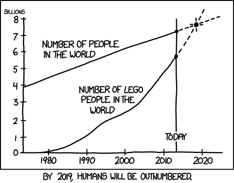
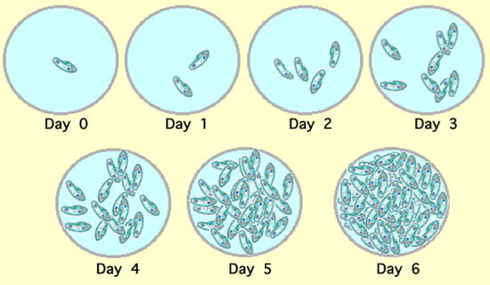
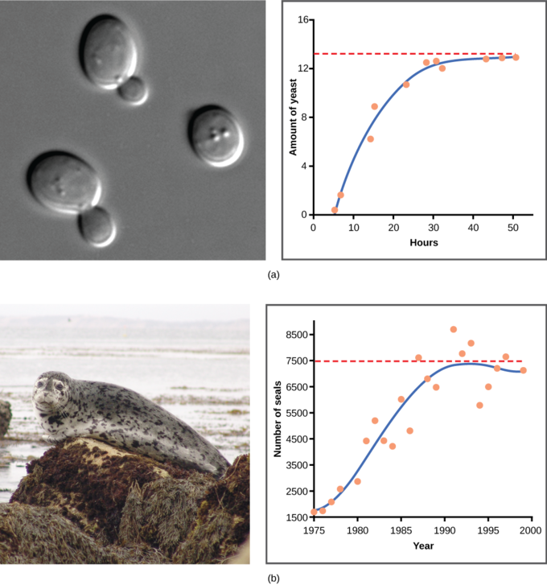

```{r setup, include=FALSE}
options(htmltools.dir.version = FALSE)
library(tidyverse)
library(data.table)
library(xaringan)
```


# 3 part lecture (with breaks)
.pull-left[
- **Part 1** Exponential growth

- **Part 2** Logistic growth - _Density dependent_

- **Part 3** Logistic growth with stochasticity
]

.pull-right[

]
---
# Part 1: Why be interested in population growth?

--
- Project future populations

  - Human population expected to be 9.8 billion by 2050

--

- Conservation of species

--

- Sustainable use of resources

--

- Many more

---
class: inverse, middle, center
#Part 1: Let's start with exponential population growth
Density independent growth
$$\frac{dN}{dt}=rN$$

---
#Exponential growth
What is required for a population to grow?

--

How many births and how many deaths?


$$N_{t+1} = N_t + B - D + I - E$$


- $B$ =  _Births_

- $D$ =  _Deaths_

- $I$ =  _Immigration_

- $E$ =  _Emigration_

--


If we assume that immigration and emmigration are equal, then the change in population size is:

$$\Delta N = B - D$$
---
#Exponential growth

$$\Delta N = B - D$$
.pull-left[
- More births than deaths the population grows
.center[

]
]

.pull-right[
- More deaths than births the population dies

{{content}}
]

--


{{content}}


---
#Exponential growth

_Change in population_ ( $dN$ ) _over a very small interval of time_ ( $dt$ ) can be described as: 

$$\frac{dN}{dt}=B-D$$

--

- Births and deaths are also described in rates:

.pull-left[
$$B = bN$$
$b$ = instantaneous birth rate

[births / (individual * time)]
]

.pull-right[
$$D = dN$$


$d$ = instantaneous death rate

[deaths / (individual * time)]

]
---
#Exponential growth
_SO_ change in population over time can be described as

$$\frac{dN}{dt}=(b-d)N$$

--

$$\frac{dN}{dt}=(0.55-0.50)N$$

--

$$\frac{dN}{dt}=(0.55-0.50)*100$$
--

$$\frac{dN}{dt}=0.05*100$$
--

$$\frac{dN}{dt}=5$$

---
#Exponential growth

If we let $b-d$ become the constant $r$, the __intrinsic rate of increase__, we have the continuous exponential growth equation:

$$\frac{dN}{dt}=rN$$
--

.center[

]

---
#Exponential growth

Change in population is equal to the intrinsic rate of increase ( $r$ ) multiplied by the population size ( $N$ )

.pull-left[
$$\frac{dN}{dt}=rN$$
]

.pull-right[
$N$ = _population size_

$r$ = _intrinsic rate or increase_
]


$r$ defines how fast a population is growing or declining
- $r=0$ no growth
- $r>0$ positive growth 
- $r<0$ negative growth

The differential equation tells us growth __rate__ not population size

---
#Exponential growth
The population of an exponentially growing population at a given time $t$ can be worked out by:

$$N_t = N_0e^{rt}$$
Look familiar from assignment 1?

--

The discrete version of the exponential equation tells us the number added to the population per time-step:

$$N_{t+1} = N_t + r_dN_t$$

$$N_{t+1} = 100 + 0.05 * 100$$
$$N_{t+1} = 105$$
$N_t$ = Population size at time t

$r_d$ = discrete growth factor

---
#Exponential growth

.pull-left[

Theoretical populations of populations growing (and declining) as a result of different values of $r$

- $r=0$ no growth
- $r>0$ positive growth 
- $r<0$ negative growth

Because growth rate is exponential, by taking the natural logarithm of the population size the graphed lines become straight

]


.pull-right[
```{r plot-exp, echo = FALSE, fig.width=5, fig.height=5,fig.show='hold'}
r_exp.fun <- function(r = 0.05, N_pop = 10, t = 100)
{
  N <- vector("numeric", length = t)
  N[1] <- N_pop
  for (i in 2:t)
  {
    N[i] <- N[i-1] + (N[i-1] * r)
  }
  return(N)
}

args_list <- list(0.02, 0.01, 0.00, -0.02)

pop_dat <- data.frame(spp =
  mapply(
  r_exp.fun,
  r = args_list
))
#head(pop_dat)
pop_dat <- pop_dat %>% 
  mutate(time = 1:n()) %>% 
  gather(key = key, value = value, -time)
#head(pop_dat)

ggplot(pop_dat, aes(x = time, y = value, colour = key))+
  geom_line(show.legend = FALSE)+
  annotate("text", x = 60, y = c(40, 22, 12, 0.9), label = c("r = 0.02","r = 0.01","r = 0", "r = -0.02"))+
  ylab("population size (N)")+
  theme_minimal()

```

]
---
# Exponential growth
.pull-left[Exponential growth]
.pull-right[Logarithm of exponential growth]


```{r plot-chunk, echo = FALSE, fig.width=5, fig.height=5,fig.show='hold'}
r_exp.fun <- function(r = 0.05, N_pop = 10, t = 100)
{
  N <- vector("numeric", length = t)
  N[1] <- N_pop
  for (i in 2:t)
  {
    N[i] <- N[i-1] + (N[i-1] * r)
  }
  return(N)
}

args_list <- list(0.02, 0.01, 0.00, -0.02)

pop_dat <- data.frame(spp =
  mapply(
  r_exp.fun,
  r = args_list
))

pop_dat_gathered <- pop_dat %>% 
  mutate(time = 1:n()) %>% 
  gather(key = key, value = value, -time)


ggplot(pop_dat_gathered, aes(x = time, y = value, colour = key))+
  geom_line(show.legend = FALSE)+
  annotate("text", x = 60, y = c(40, 22, 12, 0.9), label = c("r = 0.02","r = 0.01","r = 0", "r = -0.02"))+
  ylab("population size (N)")+
  theme_minimal()
  
ggplot(pop_dat_gathered, aes(x = time, y = log(value), colour = key))+
  geom_line(show.legend = FALSE)+
  annotate("text", x = 60, y = c(3.7, 3.2, 2.4, 0.9), label = c("r = 0.02","r = 0.01","r = 0", "r = -0.02"))+
  ylab("Logarithm of population size [ln (N)]")+
  theme_minimal()

```

---

#Growth rates

Common name | $r$ [individuals/(individual*day)]  | Doubling time
------------|-------------------------------------|---------
Virus       | 300.0                               | 3.3 minutes
Bacterium   | 58.7                                | 17 minutes
Protozoan   | 1.59                                | 10.5 hours
Hydra       | 0.34                                | 2 days
Flour beetle| 0.101                               | 6.9 days
Brown rat   | 0.0148                              | 46.8 days
Domestic cow| 0.001                               | 1.9 years
Mangrove    | 0.00055                             | 3.5 years
Southern beech | 0.000075                         | 25.3 years
---
#Growth rates
Population increases exponentially but __Growth rate__ over __population size__ increases proportionately with the population

```{r plot-chunk1, echo = FALSE, fig.width=5, fig.height=5,fig.show='hold'}
r_exp.fun <- function(r = 0.05, N_pop = 10, t = 100)
{
  N <- vector("numeric", length = t)
  N[1] <- N_pop
  for (i in 2:t)
  {
    N[i] <- N[i-1] + (N[i-1] * r)
  }
  return(N)
}


pop_dat1 <- data.frame(spp =
  r_exp.fun())

pop_dat1 <- pop_dat1 %>% 
  mutate(time = 1:n())


pop_roc_fun <- function(pop_vec){
  for (i in length(pop_vec):2)
  {
    pop_vec[i] <- pop_vec[i] - pop_vec[i-1]
  }
  pop_vec[1] <- 0
  return(pop_vec)
}

exp_pop_dat <- data.frame(exp_pop = r_exp.fun())
exp_pop_dat <- exp_pop_dat %>% 
  mutate(growth_rate = pop_roc_fun(exp_pop))

ggplot(pop_dat1, aes(x = time, y = spp))+
  geom_line(show.legend = FALSE, colour = "red")+
  annotate("text", x = 60, y = c(400), label = c("r = 0.02"))+
  ylab("population size (N)")+
  theme_minimal()
  
ggplot(exp_pop_dat, aes(x = exp_pop, y = growth_rate))+
  geom_line(show.legend = FALSE, colour = "red")+
  annotate("text", x = 500, y = c(40), label = c("r = 0.02"))+
  xlab("Population size (N)")+
  ylab("rate of change (dN/dt)")+
  theme_minimal()

```
---
# Exponential growth

- Populations growing exponentially have a doubling time

- The doubling time depends on the growth rate $r$ and is _not_ every year

- Surely no species can grow forever exponentially?!?!?!
 - _Correct!_ Welcome to part 2, __density dependence__

---
class: inverse, middle, center

#Take 5 minutes to discuss the assumptions of the exponential growth model

---
class: inverse, middle, center

#Part 2: Logistic population growth
Density dependent growth
$$\frac{dN}{dt}=rN\left(1- \frac{N}{K} \right)$$
---
#Logistic growth
Now we will look at populations which do not grow forever but reach a __carrying capacity__ ( $K$ )

$K$ represents the maximum population size that can be supported considering limiting factors such as food, shelter and space

$$\frac{dN}{dt}=rN\left(1- \frac{N}{K} \right)$$
$N$ = Population size

$r$ = Intrinsic rate of increase

$K$ = Carrying capacity

---
#Logistic growth
Consider the term $\left(1- \frac{N}{K} \right)$ as a penalty on the growth of the population depending on the number of individuals in the community

- Very crowded communities have a high penalty compared to ones with plenty of space and resources

$$\frac{dN}{dt}=rN\left(1- \frac{N}{K} \right)$$


--
- At the point the population reaches the carrying capacity: $N$ will = $K$, and the fraction $\frac{N}{K}$ will = 1

- The term $\left(1- \frac{N}{K} \right)$ will collapse to 0 and the change in population will = 0. The equation will be multiplied by 0 and equal 0

- So the population will remain at size $K$

---

#Logistic growth
If the population is very small, $N$ is small relative to $K$, then the penalty is small

$$\frac{dN}{dt}=rN\left(1- \frac{N}{K} \right)$$
--

However, as we learned from exponential growth, a population grows in proportion to its size.

  - A population of 1000 seabirds will produce more eggs than a population of 100.
  - In the logistic growth equation the proportion added to the population decreases as the population grows reaching 0 when $N = K$
  


---
#Logistic growth
$$\frac{dN}{dt}=rN\left(1- \frac{N}{K} \right)$$
- If $K = 100$ and $N = 7$ then the unused space is $1-(7/100) = 0.93$ and the population is growing at 93% of the growth rate of an exponentially growing population

- If $K = 100$ and $N = 98$ then the unused proportion of capacity is $1-(98/100) = 0.02$ and growth is at 2% of the growth rate of an exponentially growing population

--

The point at which a population is the largest relative to the penalty for its size is at $K/2$

- What this means is the growth rate of a population is fastest at half its carrying capacity
  
- As it grows bigger than $K/2$ the penalty becomes stronger but below $K/2$ the population is small and the proportion added to the population is small

---
#Logistic growth

_Thanos should have studied population ecology_

.pull-left[

- If a species is at capacity, its growth rate will increase to maximum if you cut it in half.

- Not all species are equal so cutting all in half will not have an equal effect...
]

.pull-right[

]
---
#Logistic growth

.pull-left[
_Paramecium_ growing to capacity.


]

.pull_right[
```{r plot-chunk2, echo = FALSE, fig.width=5, fig.height=5,fig.show='hold'}
r_logistic.fun <- function(r = 0.05, K = 1000, N_pop = 10, t = 250)
{
  N <- vector("numeric", length = t)
  N[1] <- N_pop
  for (i in 2:t)
  {
    N[i] <- N[i-1] + (r * N[i-1] * (1 - N[i-1] / K))   # version 2 with R
  }
  N <- ifelse(N <= 0, 0, N)
  return(N)
}

logistic_pop <- data.frame(pop = r_logistic.fun())
logistic_pop <- logistic_pop %>% 
  mutate(time = 1:n())

ggplot(logistic_pop, aes(x = time, y = pop))+
  geom_line(show.legend = FALSE, colour = "red")+
  #annotate("text", x = 50, y = c(500), label = c("r = 0.05"))+
  ylab("Population size (N)")+
  theme_minimal()
```
]
---
#Logistic growth
.center[

]
---

#Logistic growth
Now we will look at the discrete form of the equation:

$$N_{t+1} = N_t + r_dN_t\left(1- \frac{N_t}{K} \right)$$
$N_t$ = Population size at time t

$r_d$ = discrete growth factor

$K$ = Carrying capacity

--

- Instead of telling us the change in a population at an infinitely small point in time, the discrete equation tells us the size of the population at a given time.

---
#Logistic growth

The size of the population at the next time-step is equal to:

- The size of the current population plus the current population multiplied by the discrete growth rate and the density penalty.

$$N_{t+1} = N_t + r_dN_t\left(1- \frac{N_t}{K} \right)$$
--

$$N_{t+1} = 100 + 0.05 * 100 \left(1- \frac{100}{200} \right)$$
--

$$N_{t+1} = 102.5$$
--
Remember how in the exponential model $N_{t+1} = 105$ ?

---
#Logistic growth

__Unlike__ the exponential model, the logistic model growth rate is dependent on population size and reaches its peak at half of the carrying capacity 

```{r plot-chunk3, echo = FALSE, fig.width=5, fig.height=5,fig.show='hold'}
r_logistic.fun <- function(r = 0.05, K = 1000, N_pop = 10, t = 250)
{
  N <- vector("numeric", length = t)
  N[1] <- N_pop
  for (i in 2:t)
  {
    N[i] <- N[i-1] + (r * N[i-1] * (1 - N[i-1] / K))   # version 2 with R
  }
  N <- ifelse(N <= 0, 0, N)
  return(N)
}

pop_roc_fun <- function(pop_vec){
  for (i in length(pop_vec):2)
  {
    pop_vec[i] <- pop_vec[i] - pop_vec[i-1]
  }
  pop_vec[1] <- 0
  return(pop_vec)
}

logistic_pop <- data.frame(pop = r_logistic.fun())
logistic_pop <- logistic_pop %>% 
  mutate(time = 1:n())


logistic_pop_dat <- data.frame(logistic_pop_dat = r_logistic.fun())
logistic_pop_dat <- logistic_pop_dat %>% 
  mutate(growth_rate = pop_roc_fun(logistic_pop_dat))


ggplot(logistic_pop, aes(x = time, y = pop))+
  geom_line(show.legend = FALSE, colour = "red")+
  annotate("text", x = 50, y = c(500), label = c("r = 0.05"))+
  ylab("Population size (N)")+
  theme_minimal()


ggplot(logistic_pop_dat, aes(x = logistic_pop_dat, y = growth_rate))+
  geom_line(show.legend = FALSE, colour = "red")+
  annotate("text", x = 500, y = c(15), label = c("r = 0.02"))+
  xlab("Population size (N)")+
  ylab("rate of change (dN/dt)")+
  theme_minimal()

```
---
#Logistic growth
.pull-left[
Logistic growth rate vs population size
]

.pull-right[
Exponential growth rate vs population size
]


```{r plot-chunk4, echo = FALSE, fig.width=5, fig.height=5,fig.show='hold'}
r_logistic.fun <- function(r = 0.05, K = 1000, N_pop = 10, t = 250)
{
  N <- vector("numeric", length = t)
  N[1] <- N_pop
  for (i in 2:t)
  {
    N[i] <- N[i-1] + (r * N[i-1] * (1 - N[i-1] / K))   # version 2 with R
  }
  N <- ifelse(N <= 0, 0, N)
  return(N)
}

pop_roc_fun <- function(pop_vec){
  for (i in length(pop_vec):2)
  {
    pop_vec[i] <- pop_vec[i] - pop_vec[i-1]
  }
  pop_vec[1] <- 0
  return(pop_vec)
}

r_exp.fun <- function(r = 0.05, N_pop = 10, t = 100)
{
  N <- vector("numeric", length = t)
  N[1] <- N_pop
  for (i in 2:t)
  {
    N[i] <- N[i-1] + (N[i-1] * r)
  }
  return(N)
}


pop_dat1 <- data.frame(spp =
  r_exp.fun())

pop_dat1 <- pop_dat1 %>% 
  mutate(time = 1:n())


pop_roc_fun <- function(pop_vec){
  for (i in length(pop_vec):2)
  {
    pop_vec[i] <- pop_vec[i] - pop_vec[i-1]
  }
  pop_vec[1] <- 0
  return(pop_vec)
}

logistic_pop_dat <- data.frame(logistic_pop_dat = r_logistic.fun())
logistic_pop_dat <- logistic_pop_dat %>% 
  mutate(growth_rate = pop_roc_fun(logistic_pop_dat))


ggplot(logistic_pop_dat, aes(x = logistic_pop_dat, y = growth_rate))+
  geom_line(show.legend = FALSE, colour = "red")+
  annotate("text", x = 500, y = c(15), label = c("r = 0.02"))+
  xlab("Population size (N)")+
  ylab("rate of change (dN/dt)")+
  theme_minimal()

exp_pop_dat <- data.frame(exp_pop = r_exp.fun())
exp_pop_dat <- exp_pop_dat %>% 
  mutate(growth_rate = pop_roc_fun(exp_pop))
  
ggplot(exp_pop_dat, aes(x = exp_pop, y = growth_rate))+
  geom_line(show.legend = FALSE, colour = "red")+
  annotate("text", x = 500, y = c(40), label = c("r = 0.02"))+
  xlab("Population size (N)")+
  ylab("rate of change (dN/dt)")+
  theme_minimal()

```

---

class: inverse, middle, center

#Take 5 minutes to discuss the assumptions of the logistic growth model

---

class: inverse, middle, center

#Part 3: Introducing stochasticity
Non-deterministic growth

---
#Stochasticity

Until now, everything we have looked at has been _entirely_ deterministic but is this true of the real world?

$$N_{t+1} = N_t + r_dN_t\left(1- \frac{N_t}{K} \right)$$

.pull-left[
Environmental stochasticity
- Populations go through good and bad times and are not constant
- We can represent this by adding variance to the growth rate $r_d$
]

.pull-right[
Demographic stochasticity
- By chance a population might have a run of births or a run of deaths
- Demographic stochasticity includes the probability of births and deaths in the parmeter $r$
]

- Variability can also be included in $K$, the carrying capacity!


We will focus on _environmental stochasticity_
---
#Stochasticity
Even if __average__ growth rate is positive some stochasticity can drive extinction

```{r plot-chunk5, echo = FALSE, fig.width=5, fig.height=5,fig.show='hold'}
r_stochastic.fun <- function(r_mu = 0.05, r_sd = 0.15, K = 1000, N_pop = 10, t = 250)
{
  pop_df <- data.frame(r_vec = rnorm(t, r_mu, r_sd),
                       N = N_pop,
                       time = 1:t)
  
  for (i in 2:length(pop_df$N))
  {
    pop_df$N[i] <- pop_df$N[i-1] + (pop_df$r_vec[i-1] * pop_df$N[i-1] * (1 - pop_df$N[i-1] / K))   # version 2 with R
  }
  pop_df$N <- ifelse(pop_df$N <= 0, 0, pop_df$N)
  
  # pop_df <- pop_df %>% 
  #   mutate(stoch_pop = N + (r_vec * N) * (1-N / K),
  #          time = 1:n())
  # pop_df$stoch_pop[1] <- N_pop
  
  return(pop_df)
}

#stochastic_pop <- r_stochastic.fun()
stochastic_pop <- replicate(10, r_stochastic.fun(r_mu = 0.05, r_sd = 0.15, K = 1000, N_pop = 10, t = 250), simplify = FALSE)
stochastic_pop <- rbindlist(stochastic_pop, idcol = "run_id")


stochastic_pop_high <- replicate(10, r_stochastic.fun(r_mu = 0.02, r_sd = 0.3, K = 1000, N_pop = 300, t = 250), simplify = FALSE)
stochastic_pop_high <- rbindlist(stochastic_pop_high, idcol = "run_id")


ggplot(stochastic_pop, aes(x = time, y = N, group = run_id, colour = run_id))+
  geom_line(show.legend = FALSE)+
  annotate("text", x = 25, y = c(750), label = c("r = 0.05"))+
  ylab("Population size(N)")+
  xlab("time")+
  theme_minimal()


ggplot(stochastic_pop_high, aes(x = time, y = N, group = run_id, colour = run_id))+
  geom_line(show.legend = FALSE)+
  annotate("text", x = 150, y = c(750), label = c("r = 0.02"))+
  ylab("Population size(N)")+
  xlab("time")+
  theme_minimal()


```

---
#Recap

We have looked at:
- discrete and continuous equations for __exponential growth__
  - also known as __density independent__ growth
  
- discrete and continuous equations for __logistic growth__
  - also known as __density dependent__ growth
  
- __Stochastic__ logistic growth

- We have discussed model __assumptions__

---
#Key points
- __Exponentially__ growing populations grow proportional to their size indefinitely

- __Logistically__ growing populations experience a penalty that increases with population size
  - Growth rate is greatest at half the carrying capacity when the population size is at its largest relative to the density penalty
  
- __Stochasticity__ can have a serious effect on populations and deterministic models do not account for stochasticity

- __Assumptions are key__, _think about these for the assignment_
  

---

#Things to be aware of
- Differences in continuous and discrete equation
  - Different notation and descriptions of $r$
  - Mathematical differences 

- Many diferent population growth equations
  - We have not talked about the model $N_{t+1} = \lambda N_t\left(1- \frac{N_t}{K} \right)$. I recommend reading about it
  - Concepts can be transferable but be aware while reading results may not be the same
  
- This is just the beginning
  - Population growth models get _much much_ more complicated to deal with more complicated species, for example, age structured population and competition

---

class: inverse, middle, center

#Go forth and model!!!


<!-- <iframe src="https://quinnasena.shinyapps.io/r_logistic/" width="100%" height="1024px"></iframe> -->

<!-- pagedown::chrome_print("pop_growth.Rmd", "growth_app/www/pop_growth.pdf")
