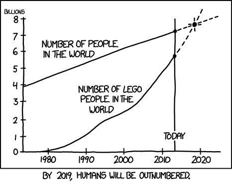
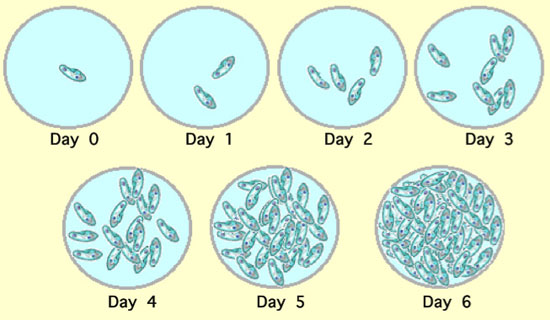
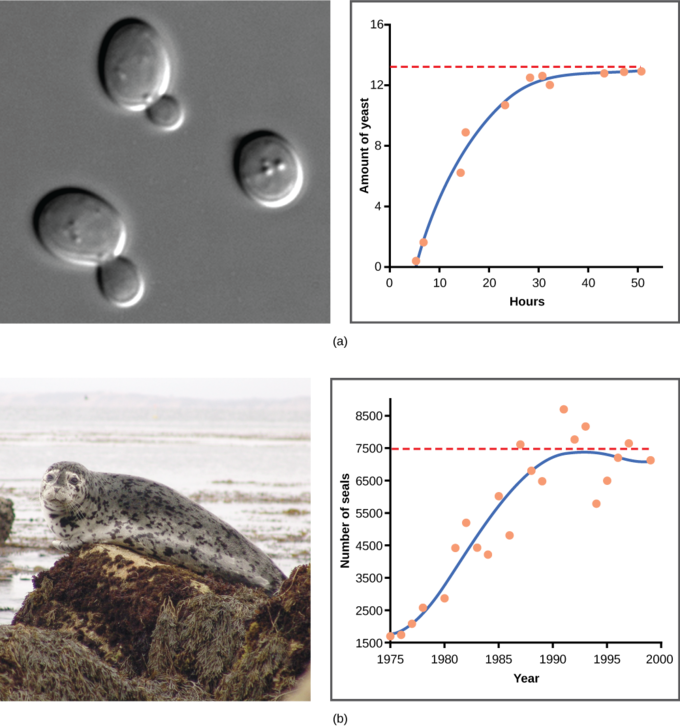

```{r}
#| label: setup
#| include: false
library(tidyverse)

# Discrete exponential growth
exp_growth <- function(r = 0.05, N_pop = 10, t = 100) {
  N <- vector("numeric", length = t)
  N[1] <- N_pop
  for (i in 2:t) {
    N[i] <- N[i-1] + (N[i-1] * r)
  }
  return(N)
}

# Discrete logistic growth
logistic_growth <- function(r = 0.05, K = 1000, N_pop = 10, t = 250) {
  N <- vector("numeric", length = t)
  N[1] <- N_pop
  for (i in 2:t) {
    N[i] <- N[i-1] + (r * N[i-1] * (1 - N[i-1] / K))
  }
  N <- ifelse(N <= 0, 0, N)
  return(N)
}

# Stochastic logistic growth
stochastic_growth <- function(r_mu = 0.05, r_sd = 0.15, K = 1000, N_pop = 10, t = 250) {
  pop_df <- data.frame(
    r_vec = rnorm(t, r_mu, r_sd),
    N     = N_pop,
    time  = 1:t
  )
  for (i in 2:nrow(pop_df)) {
    pop_df$N[i] <- pop_df$N[i-1] + (pop_df$r_vec[i-1] * pop_df$N[i-1] * (1 - pop_df$N[i-1] / K))
  }
  pop_df$N <- ifelse(pop_df$N <= 0, 0, pop_df$N)
  return(pop_df)
}

# Rate of change between consecutive time steps
rate_of_change <- function(pop_vec) c(0, diff(pop_vec))

# Custom ggplot theme for dark revealjs slides
theme_lecture <- function(base_size = 13) {
  theme_minimal(base_size = base_size) +
    theme(
      plot.background   = element_rect(fill = "transparent", colour = NA),
      panel.background  = element_rect(fill = "transparent", colour = NA),
      legend.background = element_rect(fill = "transparent", colour = NA),
      panel.grid.major  = element_line(colour = "grey30"),
      panel.grid.minor  = element_line(colour = "grey20"),
      text              = element_text(colour = "grey90"),
      axis.text         = element_text(colour = "grey65"),
      axis.title        = element_text(colour = "grey90"),
    )
}
```

## 3-part lecture (with breaks)

::: {.columns}
:::: {.column width="50%"}
- **Part 1** Exponential growth

- **Part 2** Logistic growth — _density dependent_

- **Part 3** Logistic growth with stochasticity
::::

:::: {.column width="50%"}

::::
:::

## Part 1: Why study population growth?

. . .

- Project future populations

  - Global human population expected to reach 9.8 billion by 2050

. . .

- Conservation of threatened species

. . .

- Sustainable use of natural resources

. . .

- Informing management of invasive species, fisheries, and epidemics

## Part 1: Exponential population growth {background-color="#09414d"}

::: {style="text-align: center;"}
Density independent growth
$$\frac{dN}{dt}=rN$$
:::

## Exponential growth

What is required for a population to grow?

. . .

How many births and how many deaths?

$$N_{t+1} = N_t + B - D + I - E$$

- $B$ = _Births_
- $D$ = _Deaths_
- $I$ = _Immigration_
- $E$ = _Emigration_

. . .

If we assume immigration and emigration are equal, the change in population size simplifies to:

$$\Delta N = B - D$$

## Exponential growth

$$\Delta N = B - D$$

::: {.columns}
:::: {.column width="50%"}
- More births than deaths: the population grows

::: {style="text-align: center;"}
{width="50%"}
:::
::::

:::: {.column width="50%"}
- More deaths than births: the population declines

::: {.fragment}

:::
::::
:::

## Exponential growth

_Change in population_ ($dN$) _over a very small interval of time_ ($dt$):

$$\frac{dN}{dt}=B-D$$

. . .

Births and deaths are expressed as per-capita rates:

::: {.columns}
:::: {.column width="50%"}
$$B = bN$$
$b$ = instantaneous birth rate

[births / (individual · time)]
::::

:::: {.column width="50%"}
$$D = dN$$

$d$ = instantaneous death rate

[deaths / (individual · time)]
::::
:::

## Exponential growth

Substituting gives change in population over time:

$$\frac{dN}{dt}=(b-d)N$$

. . .

$$\frac{dN}{dt}=(0.55-0.50)N$$

. . .

$$\frac{dN}{dt}=(0.55-0.50)\times100$$

. . .

$$\frac{dN}{dt}=0.05\times100$$

. . .

$$\frac{dN}{dt}=5$$

## Exponential growth

Letting $r = b - d$, the __intrinsic rate of increase__, gives the continuous exponential growth equation:

$$\frac{dN}{dt}=rN$$

. . .

::: {style="text-align: center;"}
{width="60%"}
:::

## Exponential growth

::: {.columns}
:::: {.column width="50%"}
$$\frac{dN}{dt}=rN$$
::::

:::: {.column width="50%"}
$N$ = _population size_

$r$ = _intrinsic rate of increase_
::::
:::

$r$ determines whether a population grows or declines:

- $r = 0$ &nbsp; no change
- $r > 0$ &nbsp; population grows
- $r < 0$ &nbsp; population declines

The differential equation describes the growth **rate**, not the population size.

## Exponential growth

The size of an exponentially growing population at time $t$:

$$N_t = N_0e^{rt}$$

. . .

The **discrete** version gives population size per time-step:

$$N_{t+1} = N_t + r_dN_t$$

$$N_{t+1} = 100 + 0.05 \times 100 = 105$$

$N_t$ = population size at time $t$

$r_d$ = discrete growth rate

## Exponential growth

::: {.columns}
:::: {.column width="50%"}

Theoretical populations with different values of $r$

- $r = 0$ &nbsp; no change
- $r > 0$ &nbsp; growth
- $r < 0$ &nbsp; decline

Taking the natural log of population size linearises exponential growth.

::::

:::: {.column width="50%"}
```{r}
#| label: plot-exp
#| fig-width: 5
#| fig-height: 5
args_list <- list(0.02, 0.01, 0.00, -0.02)

pop_dat <- data.frame(spp = mapply(exp_growth, r = args_list)) |>
  mutate(time = 1:n()) |>
  pivot_longer(cols = -time, names_to = "key", values_to = "value")

ggplot(pop_dat, aes(x = time, y = value, colour = key)) +
  geom_line(linewidth = 0.8, show.legend = FALSE) +
  annotate("text", x = 60, y = c(40, 22, 12, 0.9),
           label = c("r = 0.02", "r = 0.01", "r = 0", "r = -0.02"),
           colour = "grey85") +
  scale_colour_viridis_d(option = "plasma", end = 0.85) +
  labs(y = "Population size (N)") +
  theme_lecture()
```
::::
:::

## Exponential growth

::: {.columns}
:::: {.column width="50%"}
Exponential growth
::::
:::: {.column width="50%"}
Log of exponential growth
::::
:::

```{r}
#| label: plot-exp-log
#| fig-width: 5
#| fig-height: 5
#| layout-ncol: 2
ggplot(pop_dat, aes(x = time, y = value, colour = key)) +
  geom_line(linewidth = 0.8, show.legend = FALSE) +
  annotate("text", x = 60, y = c(40, 22, 12, 0.9),
           label = c("r = 0.02", "r = 0.01", "r = 0", "r = -0.02"),
           colour = "grey85") +
  scale_colour_viridis_d(option = "plasma", end = 0.85) +
  labs(y = "Population size (N)") +
  theme_lecture()

ggplot(pop_dat, aes(x = time, y = log(value), colour = key)) +
  geom_line(linewidth = 0.8, show.legend = FALSE) +
  annotate("text", x = 60, y = c(3.7, 3.2, 2.4, 0.9),
           label = c("r = 0.02", "r = 0.01", "r = 0", "r = -0.02"),
           colour = "grey85") +
  scale_colour_viridis_d(option = "plasma", end = 0.85) +
  labs(y = "ln(N)") +
  theme_lecture()
```

## Growth rates across species

| Common name    | $r$ [ind/(ind·day)] | Doubling time |
|----------------|---------------------|---------------|
| Virus          | 300.0               | 3.3 minutes   |
| Bacterium      | 58.7                | 17 minutes    |
| Protozoan      | 1.59                | 10.5 hours    |
| Hydra          | 0.34                | 2 days        |
| Flour beetle   | 0.101               | 6.9 days      |
| Brown rat      | 0.0148              | 46.8 days     |
| Domestic cow   | 0.001               | 1.9 years     |
| Mangrove       | 0.00055             | 3.5 years     |
| Southern beech | 0.000075            | 25.3 years    |

## Growth rate vs population size

Growth **rate** over population **size** increases proportionally — not absolutely.

```{r}
#| label: plot-exp-roc
#| fig-width: 5
#| fig-height: 5
#| layout-ncol: 2
exp_pop <- data.frame(N = exp_growth()) |>
  mutate(time = 1:n(),
         dNdt = rate_of_change(N))

ggplot(exp_pop, aes(x = time, y = N)) +
  geom_line(colour = "#ff6b6b", linewidth = 0.9) +
  annotate("text", x = 60, y = 400, label = "r = 0.05", colour = "grey85") +
  labs(y = "Population size (N)") +
  theme_lecture()

ggplot(exp_pop, aes(x = N, y = dNdt)) +
  geom_line(colour = "#ff6b6b", linewidth = 0.9) +
  annotate("text", x = 500, y = 40, label = "r = 0.05", colour = "grey85") +
  labs(x = "Population size (N)", y = "Rate of change (dN/dt)") +
  theme_lecture()
```

## Exponential growth — summary

- Exponentially growing populations have a **doubling time** determined by $r$ — not fixed at one year

- $r$ is constant, so growth is unbounded

- Surely no species can grow exponentially forever?

  - _Correct!_ Enter **density dependence** — Part 2.

## Assumptions of the exponential model {background-color="#09414d"}

::: {style="text-align: center;"}
Take 5 minutes to discuss the assumptions of the exponential growth model

( ͡° ͜ʖ ͡°)
:::

## Part 2: Logistic population growth {background-color="#09414d"}

::: {style="text-align: center;"}
Density dependent growth
$$\frac{dN}{dt}=rN\left(1- \frac{N}{K} \right)$$
:::

## Logistic growth

Populations do not grow forever — they reach a **carrying capacity** ($K$).

$K$ = the maximum population size supported by available resources (food, shelter, space).

$$\frac{dN}{dt}=rN\left(1- \frac{N}{K} \right)$$

$N$ = population size &nbsp;&nbsp;&nbsp; $r$ = intrinsic rate of increase &nbsp;&nbsp;&nbsp; $K$ = carrying capacity

## Logistic growth

The term $\left(1 - \frac{N}{K}\right)$ acts as a **density penalty**:

- Crowded populations incur a large penalty; sparse populations incur a small one.

$$\frac{dN}{dt}=rN\left(1- \frac{N}{K} \right)$$

. . .

- When $N = K$: $\quad\frac{N}{K} = 1$, so $\left(1 - \frac{N}{K}\right) = 0$, and $\frac{dN}{dt} = 0$

- The population stabilises at $K$

## Logistic growth

When $N$ is small relative to $K$, the penalty is small and growth is nearly exponential.

$$\frac{dN}{dt}=rN\left(1- \frac{N}{K} \right)$$

. . .

As $N$ grows, a larger fraction of capacity is used and the penalty increases:

- $K = 100$, $N = 7$: &nbsp; unused capacity $= 1 - (7/100) = 0.93$ &nbsp; → growing at 93% of exponential rate
- $K = 100$, $N = 98$: unused capacity $= 1 - (98/100) = 0.02$ → growing at 2% of exponential rate

. . .

The **maximum growth rate** occurs at $N = K/2$

## Logistic growth

_Thanos should have studied population ecology_

::: {.columns}
:::: {.column width="50%"}

- If a species is at carrying capacity, halving the population maximises its growth rate.

- But species differ in their $r$ and $K$ — the effect of halving is not equal across all species.
::::

:::: {.column width="50%"}
{width="100%"}
::::
:::

## Logistic growth

::: {.columns}
:::: {.column width="50%"}
_Paramecium_ growing to capacity.


::::

:::: {.column width="50%"}
```{r}
#| label: plot-logistic
#| fig-width: 5
#| fig-height: 5
logistic_pop <- data.frame(N = logistic_growth()) |>
  mutate(time = 1:n())

ggplot(logistic_pop, aes(x = time, y = N)) +
  geom_line(colour = "#74b9ff", linewidth = 0.9) +
  labs(y = "Population size (N)") +
  theme_lecture()
```
::::
:::

## Logistic growth

::: {style="text-align: center;"}
{width="60%"}
:::

## Logistic growth — discrete form

The **discrete** logistic equation gives population size at the next time-step:

$$N_{t+1} = N_t + r_dN_t\left(1- \frac{N_t}{K} \right)$$

$N_t$ = population size at time $t$ &nbsp;&nbsp;&nbsp; $r_d$ = discrete growth rate &nbsp;&nbsp;&nbsp; $K$ = carrying capacity

. . .

Unlike the continuous form (which gives rate of change), the discrete form gives an **absolute population size**.

## Logistic growth — worked example

$$N_{t+1} = N_t + r_dN_t\left(1- \frac{N_t}{K} \right)$$

. . .

$$N_{t+1} = 100 + 0.05 \times 100 \left(1- \frac{100}{200} \right)$$

. . .

$$N_{t+1} = 102.5$$

. . .

Compare with the exponential model: $N_{t+1} = 105$

The density penalty has already reduced growth by 2.5 individuals.

## Logistic growth — rate vs size

Unlike exponential growth, the logistic growth rate peaks at $K/2$ and returns to zero at $K$.

```{r}
#| label: plot-logistic-roc
#| fig-width: 5
#| fig-height: 5
#| layout-ncol: 2
logistic_pop2 <- data.frame(N = logistic_growth()) |>
  mutate(time = 1:n(),
         dNdt = rate_of_change(N))

ggplot(logistic_pop2, aes(x = time, y = N)) +
  geom_line(colour = "#74b9ff", linewidth = 0.9) +
  annotate("text", x = 50, y = 500, label = "r = 0.05", colour = "grey85") +
  labs(y = "Population size (N)") +
  theme_lecture()

ggplot(logistic_pop2, aes(x = N, y = dNdt)) +
  geom_line(colour = "#74b9ff", linewidth = 0.9) +
  annotate("text", x = 500, y = 15, label = "r = 0.05", colour = "grey85") +
  labs(x = "Population size (N)", y = "Rate of change (dN/dt)") +
  theme_lecture()
```

## Logistic vs exponential growth rates

::: {.columns}
:::: {.column width="50%"}
**Logistic** — rate vs population size
::::

:::: {.column width="50%"}
**Exponential** — rate vs population size
::::
:::

```{r}
#| label: plot-log-vs-exp
#| fig-width: 5
#| fig-height: 5
#| layout-ncol: 2
logistic_roc <- data.frame(N = logistic_growth()) |>
  mutate(dNdt = rate_of_change(N))

exp_roc <- data.frame(N = exp_growth()) |>
  mutate(dNdt = rate_of_change(N))

ggplot(logistic_roc, aes(x = N, y = dNdt)) +
  geom_line(colour = "#74b9ff", linewidth = 0.9) +
  annotate("text", x = 500, y = 15, label = "r = 0.05", colour = "grey85") +
  labs(x = "Population size (N)", y = "Rate of change (dN/dt)") +
  theme_lecture()

ggplot(exp_roc, aes(x = N, y = dNdt)) +
  geom_line(colour = "#ff6b6b", linewidth = 0.9) +
  annotate("text", x = 500, y = 40, label = "r = 0.05", colour = "grey85") +
  labs(x = "Population size (N)", y = "Rate of change (dN/dt)") +
  theme_lecture()
```

## Assumptions of the logistic model {background-color="#09414d"}

::: {style="text-align: center;"}
Take 5 minutes to discuss the assumptions of the logistic growth model

(ᵔᴥᵔ)
:::

## Part 3: Introducing stochasticity {background-color="#09414d"}

::: {style="text-align: center;"}
Non-deterministic growth
:::

## Stochasticity

Everything so far has been _entirely_ deterministic — but the real world is not.

$$N_{t+1} = N_t + r_dN_t\left(1- \frac{N_t}{K} \right)$$

::: {.columns}
:::: {.column width="50%"}
**Environmental stochasticity**

- Populations go through good and bad years
- Represented by adding variability to $r_d$
::::

:::: {.column width="50%"}
**Demographic stochasticity**

- By chance, births or deaths may cluster in time
- Represented by making birth and death probabilities explicit in $r$
::::
:::

. . .

Variability can also be incorporated into $K$.

We will focus on _environmental stochasticity_.

## Stochasticity

Even with a **positive average growth rate**, stochasticity can drive extinction.

```{r}
#| label: plot-stochastic
#| fig-width: 5
#| fig-height: 5
#| layout-ncol: 2
set.seed(42)

stoch_low <- replicate(10,
  stochastic_growth(r_mu = 0.05, r_sd = 0.15, K = 1000, N_pop = 10, t = 250),
  simplify = FALSE) |>
  bind_rows(.id = "run_id")

stoch_high <- replicate(10,
  stochastic_growth(r_mu = 0.02, r_sd = 0.30, K = 1000, N_pop = 300, t = 250),
  simplify = FALSE) |>
  bind_rows(.id = "run_id")

ggplot(stoch_low, aes(x = time, y = N, group = run_id, colour = run_id)) +
  geom_line(linewidth = 0.7, show.legend = FALSE, alpha = 0.85) +
  annotate("text", x = 25, y = 750, label = "r = 0.05, sd = 0.15", colour = "grey85") +
  scale_colour_viridis_d(option = "plasma") +
  labs(y = "Population size (N)", x = "Time") +
  theme_lecture()

ggplot(stoch_high, aes(x = time, y = N, group = run_id, colour = run_id)) +
  geom_line(linewidth = 0.7, show.legend = FALSE, alpha = 0.85) +
  annotate("text", x = 150, y = 750, label = "r = 0.02, sd = 0.30", colour = "grey85") +
  scale_colour_viridis_d(option = "plasma") +
  labs(y = "Population size (N)", x = "Time") +
  theme_lecture()
```

## Recap

We have covered:

- Discrete and continuous forms of **exponential growth**
  - also known as **density independent** growth

- Discrete and continuous forms of **logistic growth**
  - also known as **density dependent** growth

- **Stochastic** logistic growth

- Model **assumptions**

## Key points

- **Exponential growth**: population grows in proportion to its size, indefinitely

- **Logistic growth**: a density penalty slows growth as $N$ approaches $K$
  - Growth rate is greatest at $N = K/2$

- **Stochasticity**: can drive extinction even when average growth is positive; deterministic models cannot capture this

- **Assumptions matter** — think critically about these for your assignment

## Things to be aware of

- Continuous vs discrete equations use different notation and can give different results for large $r$

- Many variants of population growth models exist, e.g.:
  $$N_{t+1} = \lambda N_t\left(1- \frac{N_t}{K} \right)$$
  Concepts transfer, but parameter meanings and outputs may differ.

- This is just the beginning — models extend to age-structured populations, competition, predation, and more.

## Tips for the assignment

- Attend labs and office hours

- Focus on the two key graphs: population size vs time, and growth rate vs population size

- Use the Shiny app to explore parameter effects — but do not submit screenshots as figures

- Check your outputs for logical sense: if numbers look extreme, trace back your inputs and equations

## Go forth and model! {background-color="#09414d"}

::: {style="text-align: center;"}

\\ (•◡•) /

:::

<!-- pagedown::chrome_print("pop_growth.qmd", "growth_app/www/pop_growth.pdf") -->
